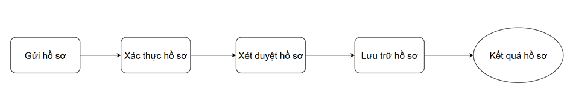

# Passport system

## 🗂️ Overview



## 📥 Project Setup

1. Clone the Repository

```
git clone https://github.com/QC2k4/BMCSDL_QLCapHoChieu.git
```

2. Configure the Database Connection

- Open the project in Microsoft Visual Studio.

- Navigate to the appsettings.json file.

- Update the ConnectionStrings section with your SQL Server instance name.

```
"ConnectionStrings": {
  "DefaultConnection": "Data Source=YOUR_SERVER;Initial Catalog=PASSPORT_SYSTEM;Integrated Security=True;Encrypt=False",
  "GSConnection": "Data Source=YOUR_SERVER;Initial Catalog=PASSPORT_SYSTEM;User ID=gs_login;Password=GS_LOGIN_BMCSDL;Trust Server Certificate=True",
  "XTConnection": "Data Source=YOUR_SERVER;Initial Catalog=PASSPORT_SYSTEM;User ID=xt_login;Password=XT_LOGIN_BMCSDL;Trust Server Certificate=True",
  "XDConnection": "Data Source=YOUR_SERVER;Initial Catalog=PASSPORT_SYSTEM;User ID=xd_login;Password=XD_LOGIN_BMCSDL;Trust Server Certificate=True",
  "LTConnection": "Data Source=YOUR_SERVER;Initial Catalog=PASSPORT_SYSTEM;User ID=lt_login;Password=LT_LOGIN_BMCSDL;Trust Server Certificate=True"
}
```

3. Apply Database Migrations

Open the Package Manager Console and run:
```
Update-Database
```
